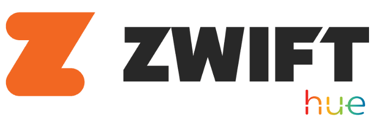
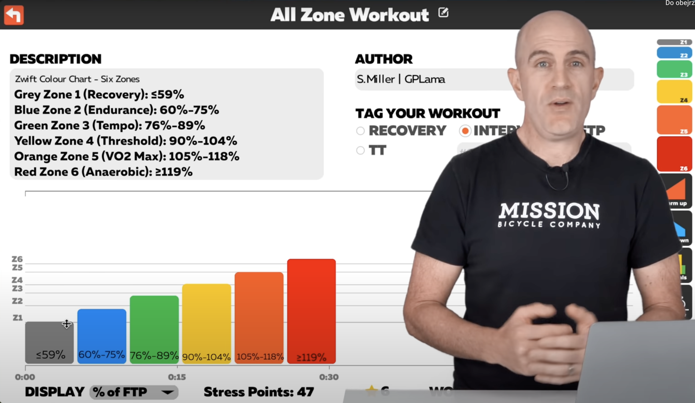

# Zwift-Hue
Philips Hue ligts automation based on power scrapped from Zwift.

# Idea
I've been riding on Zwift for a half a year now and I love it! Mostly because it pushed me towards better shape with each single workout. But as a "geek" I was trying to motivate myself even more with some tech wired into my "cycling ecosystem". An inspiration came after watching great cyclist from Poland on [Karol Classy Rider](https://www.youtube.com/watch?v=Vhw5O_2MI-8&t=426s) channel. He uses LED stripes plugged to Zwift which color matches power zone.


What a great idea! Lucukly I have some Philps Hue lamps already installed, so why not?

**I wanted to do the same!**

# How to use it?


# How does it work?
So, to make that thing work we need three things:
1. Get "real time" power generated by rider on Zwift
2. Translate power into color that matches power zone calculated based on FTP
3. Set the Hue lights with the calculated color

### Getting the power from Zwift's API
First try on getting data has been based on [Zwift Packet Monitor](https://github.com/braddwalker/ZwiftPacketMonitor) project that exposes few events, including the one that is emmited by the player a.k.a rider. This unfortunatelly is not possible to be used due to the Zwift's encryption changes that put most of the "udp-packet-based" apporaches to en end.

Therfore, current implementation is based on long polling Zwift's API that I found inside [zwift-client](https://github.com/jsmits/zwift-client) written in Python. Thanks to that every second the rider's state is fetched and transformed further. The state contains multiple usefull information that I'm going to utilize in a future:
- Power
- Cadence
- Speed (km/h)
- HR
- Ride On
- Boosts

and many more! Full list can be found in [this](./src/Protos/zwift.proto) proto file.

### Calculating power zone color
Having a rider's power it's time to convert it to the specific color that matches power zone. Fortunatelly, Zwift provides easy to implement [formula](https://zwiftinsider.com/power-zone-colors/) for that:



Converter is implmented [here](./src/Zwift/ZwiftPowerZoneConverter.cs) and "mysterious" values put in there are taken from "reversed engineered" colors set via mobile app. I simply set the color on the lamp and fetched the calculated data from Hue's API to not waste the time. More on that in next section.

In a future I need to improve the color convertion. That is because Zwift's workout target power often are on the high-end of the specific zone. This means that even small power difference will put you back and forth from one zone to another. 

### Setting Philips Hue lamps
This one was the easiest one. First, I found the Philips Hue Bridge in local network using

```bash
arg -a
```

As a result I got the IP address. To verify you have a right one, go to the browser and type

```
https://<local_IP_of_bridge>/debug/clip.html
```

You should see simple page that allows you to specify requests to your bridge. Thanks to that [repo](https://github.com/tigoe/hue-control) I found that setting up the specific color leads to endpoint

```bash
PUT http://<local_IP_of_bridge>/api/lights/<light_id>/state

BODY
{
    "on":true,
    "bri":254,
    "hue":14314,
    "effect":"none",
    "xy":[0.4791,0.4139]
}
```

- `on` - switches lamp on/off
- `bri` - brightness (0-255)
- `hue` - color (0-65535)
- `effect` - "none" or "colorloop"
- `xy` - x y position in CIE1031 colorspace

Those are the parameters you can find in the colors converter from last paragraph :)


# Features
- [x] Basic Zwift's API scrap
- [ ] UI with API
- [ ] Rider configuration persistence + selection based on Zwift's credentials
- [ ] Deal with on-edge power zones workouts
- [ ] Custom power zones/colors definition
- [ ] HR based Hue's effects
- [ ] HR-based control for fans
- [ ] ANT+ protocol support for bike trainers instead of Zwift's API
